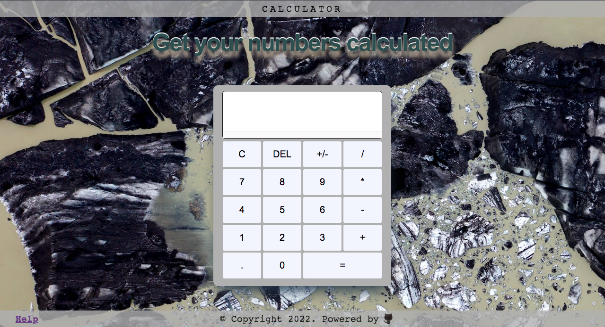

# Calculator
> Program the OG calculator.
> Live demo [_here_](https://nabelk.github.io/calculator/). <!-- If you have the project hosted somewhere, include the link here. -->

## Table of Contents
* [General Info](#general-information)
* [Technologies Used](#technologies-used)
* [Features](#features)
* [Screenshots](#screenshots)
* [Room for Improvement](#room-for-improvement)
* [Contact](#contact)

## General Information
- This project is a part of The Odin Project:Foundations course.
- This calculator supports basic operators, clear display, delete single character, adding negative numbers & decimal numbers.
- It intends to solve an operation when a user clicks their choosen input.
- To take on this project is for testing my logic and understanding the integration between HTML, CSS & Javascript.

## Technologies Used
- HTML
- CSS
- Javascript & Vanilla js

## Features
- Keyboard Support
- Sound Effects

## Screenshots

## Room for Improvement
Room for improvement:
- More to a logical way of thinking.
- Proper planning.

To do:
- Support for other responsive views such as mobile and tablet.

## Contact
Created by [@nabelk](https://www.linkedin.com/in/nabil-khalid-36791a241/) - feel free to contact me!